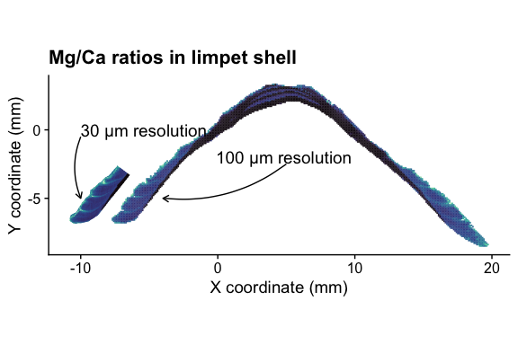

Applying Laser Induced Breakdown Spectroscopy (LIBS) and elemental imaging on marine shells for archaeological and environmental research
=============================================================================

This compendium contains the code and data to reproduce some of the figures and statistical data discussed in the article:

**Hausmann, N.**, Theodoraki, D., Piñon, V. et al. Applying laser induced breakdown spectroscopy (LIBS) and elemental imaging on marine shells for archaeological and environmental research. *Sci Rep* 13, 19812 (2023). https://doi.org/10.1038/s41598-023-46453-w

How to run
------------------------

I suggest to run the code by downloading the entire repository and executing the steps within the .Rmd file on your own PC. This will reproduce the data figures. 
The results should also be available at the bottom of this document.

You can also look into the shell maps in more detail using the shiny-shell [repository](https://github.com/Niklas-palaeo/Shiny_Shell). If you don’t want to run anything yourself, or if there is an error, you can upload the csv files to this [Shiny-App](https://nikhausmann.shinyapps.io/Shiny_Shell/). 
If you want to cite the dataset itself, you can do so by using the DOI: 10.17605/OSF.IO/JUR2D from this [Open Science Framework repository](https://osf.io/jur2d/).

Feel free to have a look around and please get in touch if you have any questions or ideas.

Niklas (niklas@palaeo.eu)

## License:
Shield: [![CC BY 4.0][cc-by-shield]][cc-by]

This work is licensed under a
[Creative Commons Attribution 4.0 International License][cc-by].

[![CC BY 4.0][cc-by-image]][cc-by]

[cc-by]: http://creativecommons.org/licenses/by/4.0/
[cc-by-image]: https://i.creativecommons.org/l/by/4.0/88x31.png
[cc-by-shield]: https://img.shields.io/badge/License-CC%20BY%204.0-lightgrey.svg

Figures
================
Niklas Hausmann
2023-11-13

**Figure Spectrum**

**Map of samples**

**Summary of shell data**

| site  | specimens | Res100 | Res30 |
|:------|----------:|-------:|------:|
| AN    |         3 |      3 |     5 |
| FR-P  |        23 |     21 |    36 |
| GYP   |         2 |      2 |     3 |
| K-CH  |         1 |      1 |     1 |
| KO-PG |         5 |      5 |     5 |
| KP-AP |        15 |     15 |    17 |
| KP-KO |         4 |      3 |     6 |
| ML    |         5 |      5 |     5 |
| NKC-M |         4 |      4 |     7 |
| PA    |         5 |      5 |     6 |
| PARK  |         2 |      1 |     2 |
| RE-G  |         1 |      1 |     1 |
| RE-L  |         2 |      2 |     2 |
| V-KB  |         6 |      6 |     7 |
| V-P   |         3 |      3 |     2 |
| Y-S   |        10 |     10 |    13 |
| Y-W   |        11 |      8 |    19 |
| Total |       102 |     95 |   137 |

**Stat Plots**

**Plot Mg/Ca distribution for all data**

**Example map for KP-AP F**

**SEM Tests**

